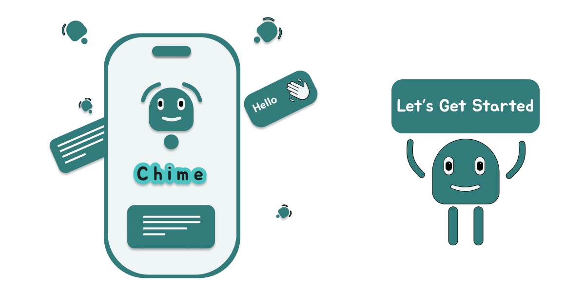

# Chime Messenger

**Chime** is a messaging platform designed to mimic the best features of existing platforms like WhatsApp and Telegram, with a focus on low latency, high reliability, and high availability. It supports both one-to-one and group chats, real-time notifications, multimedia sharing, end-to-end encryption, and ensures chat history management.

## Functional Requirements
1. **One-to-One Chat**: 
   - Real-time text and multimedia messaging between two users.
   - Support for message encryption, read receipts, and notifications.
  
2. **Group Chat**:
   - Group creation with multiple members.
   - Message sending and receiving for all group participants.
   - Admin controls (e.g., adding/removing users).
   - Support for group-specific notifications.

3. **Read Receipt**:
   - Indication when messages are sent, delivered, and read.
   - Different statuses: *Sent*, *Delivered*, *Read*.

4. **Online Status**:
   - Real-time tracking of user online/offline status.
   - Optional display of "last seen" timestamps.

5. **Notifications**:
   - Push notifications for new messages.
   - Support for message previews and interaction within notifications.
   - Customizable for one-to-one chats and group chats.

6. **Share Multimedia**:
   - Upload and share images, videos, audio files, and documents.
   - Support for real-time multimedia preview.
   - High blob storage capabilities for media files.

---

## System Requirements
1. **Low Latency**:
   - The system must minimize delays in message transmission to ensure real-time communication.
   - Use WebSockets for persistent, bi-directional communication.

2. **High Reliability**:
   - Ensure that the platform is consistently available and performs well under varying loads.
   - Implement redundancies to avoid single points of failure.

3. **High Availability**:
   - The system should be available 24/7.
   - Distribute resources geographically for regional availability.

4. **Mobile & Desktop Support**:
   - Ensure cross-platform support with mobile (iOS/Android) and desktop (Windows/macOS/Linux).
   - Responsive design for web access, if needed.

5. **Chat History**:
   - Store all chat data securely for future retrieval.
   - Allow users to access past messages even when they are offline.
   - Implement pagination or infinite scroll for message history loading.

6. **High Blob Store**:
   - High-capacity storage for media files shared within chats (images, videos, etc.).
   - Integrate a distributed file system or cloud storage for scalability.

7. **End-to-End (E2E) Encryption**:
   - All messages (text and media) should be encrypted before leaving the sender's device and only decrypted on the recipient’s device.
   - Implement public/private key encryption systems for security.

8. **WebSockets**:
   - Implement WebSockets for persistent, real-time communication between clients and the server.
   - Ensure reliable message delivery with fallback mechanisms in case of lost connections.

---

## Capacity Planning
- **Estimated Users**: 
  - *10 to 100 users per day* (Chime is intended as a demo app, so this is a small-scale deployment for testing and showcasing the platform).
  
- **Estimated Messages**: 
  - *3,600,000 messages per day* (Assuming a conservative estimate of message volume, the system needs to scale to handle large traffic in the future).

---

## Services Architecture
The following services can be implemented to handle different aspects of the messaging platform:

1. **Messaging Service**:
   - Manages sending, receiving, and storing messages.
   - Handles message delivery guarantees and read receipts.
   - Integrates with WebSockets to provide real-time functionality.

2. **Group Service**:
   - Manages group creation, membership, and permissions.
   - Handles group messaging, notification management, and history.

3. **Session Service**:
   - Manages user sessions and tracks online status.
   - Handles user authentication and session expiration.
   - Can track "last seen" times for users.

4. **Relay Service**:
   - Acts as a mediator for message delivery between users, especially in cases where direct peer-to-peer communication isn’t feasible.
   - This could be essential for group chats, where multiple participants need to receive messages in real time.

5. **Last Seen Service**:
   - Tracks the last time a user was active or sent a message, providing visibility into their online/offline status.
   - This could be stored in a lightweight session-based storage or database.

6. **Asset Service**:
   - Manages the uploading, storing, and retrieval of media files (images, videos, documents, etc.).
   - Integrates with cloud storage for scalability, handling the high blob store requirement.
   - Should have proper image/video compression and thumbnail generation.

---

## High-Level Architecture

1. **Frontend (Client)**
   - Mobile (React Native, Flutter, etc.)
   - Web (React, Vue.js, Angular)
   - WebSocket connection for real-time updates.
   - Encrypted communication for secure messaging.

2. **Backend (Server)**
   - WebSocket servers for real-time messaging.
   - REST APIs for user authentication, group management, and historical chat retrieval.
   - Database (NoSQL or SQL) for user data, chat history, and metadata.
   - Cloud storage (e.g., AWS S3, Google Cloud Storage) for multimedia assets.

3. **Services (Microservices)**
   - Messaging, Group, Session, Relay, Last Seen, Asset services as described above.

4. **Security**
   - Implement end-to-end encryption for all messages.
   - Use industry-standard algorithms (e.g., AES for message encryption, RSA for key exchange).
   - Secure storage and transmission of media files.

---

## Considerations for Scalability & Future Expansion
- **Microservices Architecture**: Use a modular approach to break down services into distinct, independently deployable components. This ensures that specific services (like messaging or media handling) can scale as needed.
  
- **Database Sharding**: Consider sharding your database to handle a larger volume of messages and data as the number of users increases.

- **Caching**: Use caching mechanisms (e.g., Redis) to speed up message retrieval, especially for chat history.

- **Global Load Balancing**: If the user base grows, implement load balancing across regions to ensure low latency and high availability.

- **Monitoring and Analytics**: Implement logging, monitoring, and performance analytics tools (e.g., Prometheus, Grafana, ELK stack) to keep track of system performance and user activity.

---

This architecture is designed to meet the functional, system, and capacity requirements of Chime while allowing for scalability and adaptability as the app grows in usage and features.
